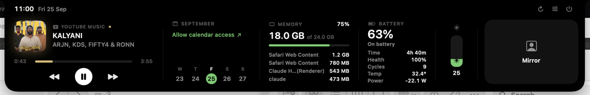
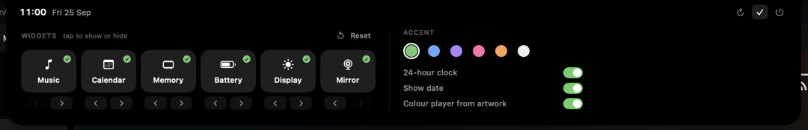

# NotchDeck

A minimal MacBook notch panel. Hover the notch and it drops open with music, calendar, memory, battery, display brightness and a camera mirror.

- Customize from the panel: show, hide and reorder widgets, pick an accent colour, and choose the clock format.
- Music controls YouTube Music and Spotify.
- Uses no CPU while closed; hidden widgets never run.

## Build

    ./build.sh && open build/NotchDeck.app

Needs macOS 14+ on Apple Silicon. On first use, grant Accessibility (music), Calendar and Camera access.
